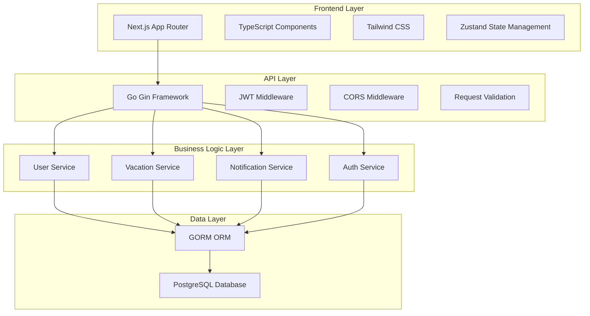

# Design Document

## Overview

The Vacation Management MVP is designed as a modern full-stack web application using Next.js for the frontend and Go with Gin framework for the backend. The system follows a clean architecture pattern with clear separation of concerns, ensuring maintainability and scalability for future enhancements.

The design prioritizes user experience with role-based dashboards, real-time updates, and compliance with Brazilian labor laws. The architecture supports the core workflow of vacation request submission, approval, and basic administration while maintaining security and performance standards.

## Architecture

### High-Level Architecture



### Technology Stack

**Frontend:**
- Next.js 14 with App Router for server-side rendering and routing
- TypeScript for type safety and better developer experience
- Tailwind CSS for responsive, utility-first styling
- Zustand for lightweight state management
- Zod for client-side validation
- NextAuth.js for authentication integration

**Backend:**
- Go 1.21+ for high-performance API server
- Gin framework for HTTP routing and middleware
- GORM for database ORM and migrations
- JWT for stateless authentication
- Swagger for API documentation

**Database:**
- PostgreSQL 15+ for reliable data persistence
- UUID primary keys for better security and scalability
- Proper indexing for query performance

## Components and Interfaces

### Frontend Components

#### Authentication Components
- `LoginForm`: Handles user authentication with email/password
- `AuthGuard`: Protects routes based on user roles
- `RoleProvider`: Manages user role context throughout the app

#### Dashboard Components
- `EmployeeDashboard`: Shows vacation balance, recent requests, quick actions
- `ManagerDashboard`: Displays pending approvals, team calendar, statistics
- `AdminDashboard`: Provides user management and system configuration

#### Vacation Request Components
- `VacationRequestForm`: Interactive form with calendar date picker
- `VacationCalendar`: Visual calendar showing available/blocked dates
- `RequestList`: Displays user's vacation request history
- `RequestCard`: Individual request display with status indicators

#### Manager Components
- `PendingApprovals`: List of requests awaiting manager action
- `ApprovalModal`: Detailed view for approving/rejecting requests
- `TeamCalendar`: Visual representation of team vacation schedules

#### Admin Components
- `UserManagement`: CRUD operations for user accounts
- `SystemSettings`: Configuration for holidays, policies, notifications
- `AuditLogs`: Display of system activity and changes

### Backend API Interfaces

#### Authentication Endpoints
```go
POST /api/auth/login
POST /api/auth/logout
GET  /api/auth/me
```

#### User Management Endpoints
```go
GET    /api/users
POST   /api/users
GET    /api/users/:id
PUT    /api/users/:id
DELETE /api/users/:id
```

#### Vacation Request Endpoints
```go
GET    /api/vacation-requests
POST   /api/vacation-requests
GET    /api/vacation-requests/:id
PUT    /api/vacation-requests/:id/approve
PUT    /api/vacation-requests/:id/reject
DELETE /api/vacation-requests/:id
```

#### Manager Endpoints
```go
GET /api/manager/pending-requests
GET /api/manager/team-calendar
GET /api/manager/team-stats
```

#### Admin Endpoints
```go
GET    /api/admin/users
POST   /api/admin/users
PUT    /api/admin/users/:id
GET    /api/admin/system-config
PUT    /api/admin/system-config
GET    /api/admin/audit-logs
```

## Data Models

### User Model
```go
type User struct {
    ID              uuid.UUID `gorm:"type:uuid;primary_key;default:gen_random_uuid()"`
    Email           string    `gorm:"uniqueIndex;not null"`
    Name            string    `gorm:"not null"`
    PasswordHash    string    `gorm:"not null"`
    Role            UserRole  `gorm:"not null"`
    DepartmentID    *uuid.UUID
    ManagerID       *uuid.UUID
    VacationBalance int       `gorm:"default:30"`
    CreatedAt       time.Time
    UpdatedAt       time.Time
    
    // Relationships
    Manager          *User             `gorm:"foreignKey:ManagerID"`
    DirectReports    []User            `gorm:"foreignKey:ManagerID"`
    VacationRequests []VacationRequest `gorm:"foreignKey:UserID"`
}

type UserRole string
const (
    RoleEmployee UserRole = "employee"
    RoleManager  UserRole = "manager"
    RoleAdmin    UserRole = "admin"
)
```

### Vacation Request Model
```go
type VacationRequest struct {
    ID               uuid.UUID     `gorm:"type:uuid;primary_key;default:gen_random_uuid()"`
    UserID           uuid.UUID     `gorm:"not null"`
    StartDate        time.Time     `gorm:"not null"`
    EndDate          time.Time     `gorm:"not null"`
    BusinessDays     int           `gorm:"not null"`
    Reason           string
    EmergencyContact string
    Status           RequestStatus `gorm:"not null;default:'pending'"`
    ApprovedBy       *uuid.UUID
    ApprovedAt       *time.Time
    RejectionReason  string
    CreatedAt        time.Time
    UpdatedAt        time.Time
    
    // Relationships
    User     User  `gorm:"foreignKey:UserID"`
    Approver *User `gorm:"foreignKey:ApprovedBy"`
}

type RequestStatus string
const (
    StatusPending   RequestStatus = "pending"
    StatusApproved  RequestStatus = "approved"
    StatusRejected  RequestStatus = "rejected"
    StatusCancelled RequestStatus = "cancelled"
)
```

### Notification Model
```go
type Notification struct {
    ID        uuid.UUID        `gorm:"type:uuid;primary_key;default:gen_random_uuid()"`
    UserID    uuid.UUID        `gorm:"not null"`
    Type      NotificationType `gorm:"not null"`
    Title     string           `gorm:"not null"`
    Message   string           `gorm:"not null"`
    Read      bool             `gorm:"default:false"`
    CreatedAt time.Time
    
    // Relationships
    User User `gorm:"foreignKey:UserID"`
}

type NotificationType string
const (
    NotificationRequest   NotificationType = "request"
    NotificationApproval  NotificationType = "approval"
    NotificationRejection NotificationType = "rejection"
    NotificationReminder  NotificationType = "reminder"
)
```

## Error Handling

### Frontend Error Handling
- Global error boundary to catch React component errors
- API error interceptor for consistent error messaging
- Form validation errors displayed inline with Zod schemas
- Toast notifications for user feedback on actions
- Fallback UI components for graceful degradation

### Backend Error Handling
```go
type APIError struct {
    Code    int    `json:"code"`
    Message string `json:"message"`
    Details string `json:"details,omitempty"`
}

// Standard HTTP error responses
400 Bad Request    - Invalid input data
401 Unauthorized   - Authentication required
403 Forbidden      - Insufficient permissions
404 Not Found      - Resource not found
409 Conflict       - Business rule violation
500 Internal Error - Server error
```

### Business Rule Validation
- Minimum 5 consecutive days validation
- 15-day advance notice requirement
- Vacation balance sufficiency checks
- Date overlap prevention
- Manager-employee relationship validation

## Testing Strategy

### Frontend Testing
- **Unit Tests**: Component testing with React Testing Library
- **Integration Tests**: API integration and user flow testing
- **E2E Tests**: Critical user journeys with Playwright
- **Visual Tests**: Component snapshot testing

### Backend Testing
- **Unit Tests**: Service layer and utility function testing with Testify
- **Integration Tests**: Database operations and API endpoint testing
- **Contract Tests**: API contract validation with generated schemas
- **Load Tests**: Performance testing for critical endpoints

### Test Coverage Goals
- Minimum 80% code coverage for both frontend and backend
- 100% coverage for business logic and validation functions
- Critical path testing for vacation request workflow
- Security testing for authentication and authorization

### Testing Environment
- Separate test database with seed data
- Mock external services (email, notifications)
- Automated testing in CI/CD pipeline
- Performance benchmarks for API response times